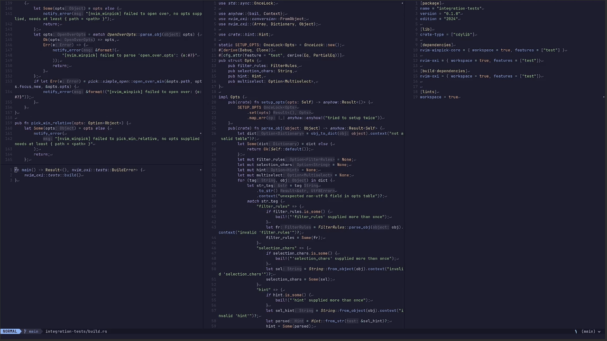

# `nvim_winpick`

A window picker and mover for neovim

## What it does

It extends the functionality of [nvim-window-picker](https://github.com/s1n7ax/nvim-window-picker), which is an amazing 
and simple plugin, to do more out of the box through a rewrite. Like placing new windows into an already present grid of windows, interactively 
swapping windows, closing windows, and more.


### Default configuration

The default configuration is mostly the same as [nvim-window-picker](https://github.com/s1n7ax/nvim-window-picker), but a bit reduced in scope.

```lua
return {
    -- Default with no branch will build from source
    "MarcusGrass/nvim_winpick",
    -- If not wanting to build from source, specify your architecture here
    -- prebuilds are available for `x86_64-unknown-linux-gnu`, `aarch64-unknown-linux-gnu`, and `aarch64-apple-darwin`
    -- Since I'm using `x86_64-unknown-linux-gnu`, only that one is field-tested.  
    branch = "x86_64-unknown-linux-gnu",
    lazy = false,
    opts = {
        -- Which chars should be used as visual prompts, no repetitions allowed.
        -- Some chars are not rendered for the hint 'floating-big-letter', those will 
        -- cause an if used (same with repetitions).
        selection_chars = "FJDKSLA;CMRUEIWOQP",
        filter_rules = {
            -- If there's only one window to choose after filtering, immediately pick it
            autoselect_one = true,
            -- Include the currently focused window
            include_current_win = true,
            -- Include windows that cannot be focused
            include_unfocusable_windows = false,
            -- Bufferoptions that should be filtered on
            bo = {
                filetype = {
                    -- filetype exactly matches
                    "NvimTree", "neo-tree", "notify", "snacks_notif",
                },
                buftype = {
                    -- buftype exactly matches
                    "terminal", "nofile", "prompt",
                },
            },
            file_path_contains = {
                -- This is an array of excluding sub-strings of a file-path
                -- Ex: /home/me/docs/my-file.md would be matched by 'docs/my'
            },
            file_name_contains = {
                -- This is an array of excluding sub-strings of a filename
                -- Ex: /home/me/docs/my-file.md would be matched by 'my-file' but not 'docs'

            },
        },
        -- "floating-big-letter" or "floating-letter" is valid here
        hint = "floating-big-letter",

        -- characters that control multiselect
        -- both or none must be present
        multiselect = {
            -- Not set by default, character that triggers a multiselect (if available on the action)
            -- trigger_char = "m",
            -- Not set by default, character that triggers a commit of the selected windows (if available on the action)
            -- commit_char = "c",
        },
    }
    end,
}
```

### Exposed functions

There are a few exposed functions through the library

#### Setup 

```lua 
require("nvim_winpick").setup(opts);
```
The setup isn't necessary to run, but if you want to change the default/fallback options, it needs to be run.  

#### pick_window

```lua
require("nvim_winpick").pick_window(opts);
```

Visually prompts to pick a window, exactly the same as [nvim-window-picker](https://github.com/s1n7ax/nvim-window-picker), returns 
the window-id.

#### pick_multiple_windows

```lua
require("nvim_winpick").pick_multiple_windows(opts);
```

Visually prompts to pick one or more windows, the only difference between this and `pick_window` is that if 
`multiselect` is set on the default options, or provided options, the `trigger_char` can be used to enter multi-pick mode, 
which allows picking many windows, highlighting the ones picked. The `commit_char` will end the multi-pick and return 
a list of windows. As with the above, mostly useful if doing extensions with your own code. Separated from `pick_window` 
to make the return-type more predictable.

Shown in the main demo when closing multiple windows.

#### pick_focus_window

```lua
require("nvim_winpick").pick_focus_window(opts);
```

Will trigger a window-pick and switch focus to the picked window.


#### pick_close_window

```lua
require("nvim_winpick").pick_close_window(opts);
```

Will trigger a window-pick and close the selected window(s), if `multiselect` is set, multiple windows 
can be picked and closed simultaneously.

#### pick_swap_window

```lua
require("nvim_winpick").pick_swap_window(opts);
```

Will trigger a window-pick and swap the currently focused window with the picked window.



#### pick_open_split

```lua
local open_split_opts = {
    -- required path for the buffer to open
    path = "./Myfile.md",
    -- whether to focus the newly opened window
    focus_new = true,
    -- vertical split
    vertical = false,
    -- the general opts for picking and filtering
    opts = default_opts,
}
require("nvim_winpick").pick_open_split(open_split_opts)
```

Will trigger a window-pick and create a split with the new buffer defined by the provided options.


#### pick_open_over 

```lua
local open_over_opts = {
    -- required path for the buffer to open
    path = "./Myfile.md",
    -- whether to focus the newly opened window
    focus_new = true,
    -- the general opts for picking and filtering
    opts = default_opts,
}
```

Will trigger a window-pick, the newly opened window will replace the picked window.

#### pick_open_relative 

```lua
local open_relative_opts = {
    -- required path for the buffer to open
    path = "./Myfile.md",
    -- whether to focus the newly opened window
    focus_new = true,
    -- chars for the second-step relative pick, if not supplied, opts->selection_chars will be used
    relative_chars = "ABCDEFGHIJKLM"
    -- the general opts for picking and filtering
    opts = default_opts,
}
```

Will trigger two prompts, first to pick a window like the above, then a second prompt to pick one of `9` Positions.

    1. Topmost, opens a full-width split at the top of the grid
    2. Rightmost, opens a full-height split at the far right of the grid
    3. Bottommost, opens a full-width split at the bottom of the grid
    4. Leftmost, opens a full-height split at the far left of the grid
    5. top center, opens a horizontal split, splitting the picked window, opening the new window at the top of the split
    6. right center, opens a vertical split, splitting the picked window, opening the new window at the right of the split
    7. bottom center, opens a horizontal split, splitting the picked window, opening the new window at the bottom of the split
    8. left center, opens a vertical split, splitting the picked window, opening the new window at the left of the split
    9. center, opens the new window over the picked window

See the main demo for a preview.

## Why

I've found that managing splits, and working with them as I'd like, especially in combination with other libraries is tricky.
For example, I may want to open a file from a [snacks](https://github.com/folke/snacks.nvim) picker `vsplit` to the right of 
my current window. 

It's very much possible to do that with just the picker and neovim builtins, but I never managed to get the hang of it.

[nvim-window-picker](https://github.com/s1n7ax/nvim-window-picker) can help solve that problem, it allows you to 
interactively pick a window and get the window id. If using a `lua`-config, you can then create everything that this 
plugin does.

The reason that I built this was because I have several things that I want to be able to do, that requires 
more complex code than I'd want to write in `lua`.  

## Installation

See [Install.md](./Install.md)

## License 

This project is licensed under the Apache 2.0-license [see it here](./LICENSE).  

`floating-big-letter` characters, and general inspiration is taken from [neovim-win-picker](https://github.com/s1n7ax/nvim-window-picker/tree/main).
Which has an MIT-license, you can see that license [here](https://github.com/s1n7ax/nvim-window-picker/blob/main/LICENSE).  

One file is more or less a direct copy of code from [neovim-win-picker](https://github.com/s1n7ax/nvim-window-picker/tree/main), 
that file is [here](./nvim-winpick-core/src/chars.rs), that file also carries the [nvim-window-picker](https://github.com/s1n7ax/nvim-window-picker/tree/main) 
MIT-license (also included as a header of that file).  

## Credits

Obviously credit goes to [neovim-win-picker](https://github.com/s1n7ax/nvim-window-picker/tree/main) which inspired this plugin.

